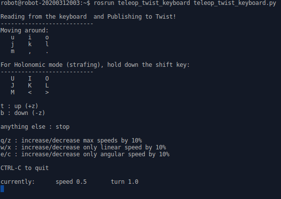
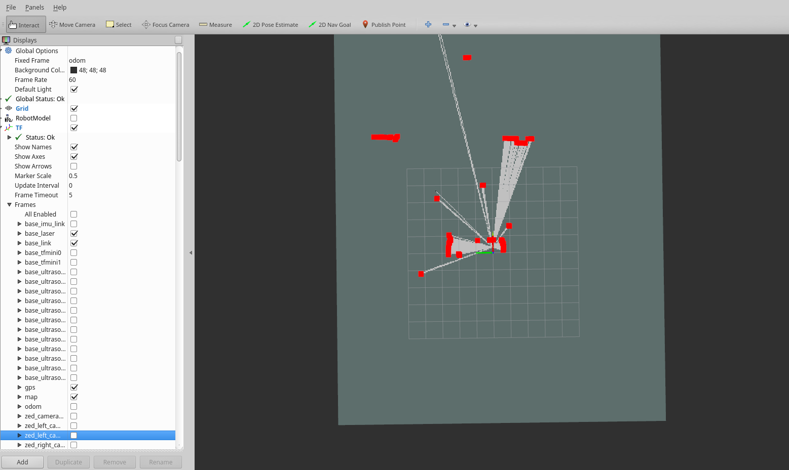
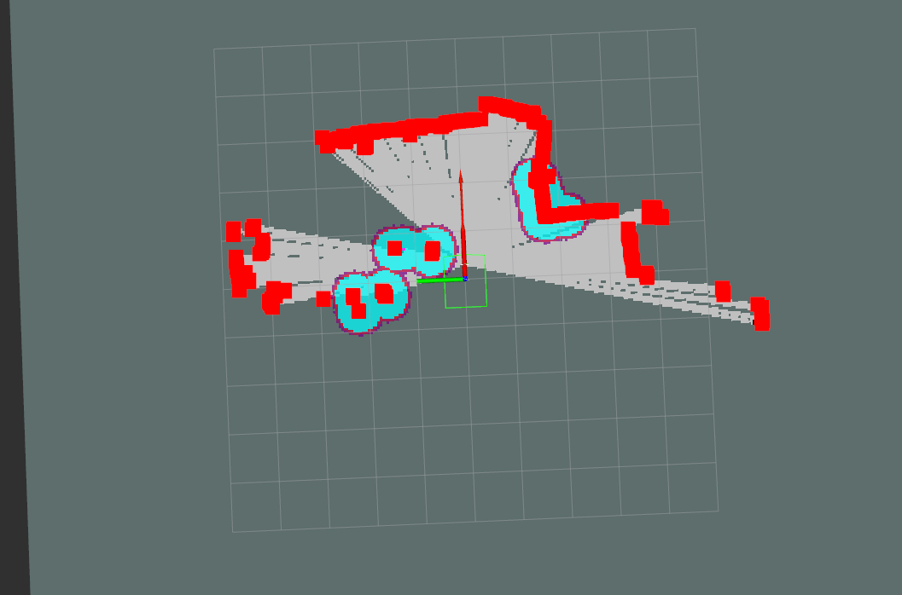

# dlos 

## 概述
dlos 包是大陆机器人底盘的Linux ROS驱动,在Ubuntu 16.04  ,Ubuntu 18.04 安装有ROS 的主机编译测试通过

## 安装依赖库

安装完ROS 环境后需要安装编译以及运行所依赖的包

```
    sudo apt-get update
    sudo apt install git build-essential ros-$ROS_DISTRO-slam-gmapping ros-$ROS_DISTRO-navigation ros-$ROS_DISTRO-laser-filters ros-$ROS_DISTRO-robot-pose-publisher ros-$ROS_DISTRO-serial ros-$ROS_DISTRO-robot-upstart ros-$ROS_DISTRO-teleop-twist-keyboard libpcap-dev
```
## 获取程序源码
打开一个终端 从仓库获取源码

```
    git clone https://github.com/qs371102/dlos.git
```

## 编译
编译源码 并设置必要的环境变量

```
    cd dlos
    catkin_make -DCMAKE_BUILD_TYPE=release
    echo "source `pwd`/devel/setup.bash"  >> ~/.bashrc
    source ~/.bashrc
```


## 修改底盘参数
编辑andi.yaml 底盘参数

```
    roscd dalu_robot/config
    nano andi.yaml
```
用卷尺或者卡尺量出机器轮子直径:wheel_diameter    左右轮中点的间距:wheel_track(需注意有两处)修改对应参数的数值为测量值
同时要留意里程计类型,如果机器只有四个轮子需要将  odom_type 的值改为 1

```    
  dl_base_controller:
    wheel_diameter: 0.155    #轮子直径　单位米
    encoder_resolution: 336　　#轮子编码器分辨率　　大logo 260   新版小logo 336
    base_callback_length: 54 #底盘反馈协议长度（不需要修改）
    use_hall: true　　　　　　　　　　　#使用霍尔计数器　还是码盘　默认使用霍尔　　　　
  dl_deltas_odometry:
    odom_type: 2             #六轮底盘默认是 2 中间轮模式   四轮或8轮机器值要改为 1
    wheel_track: 0.615　　　　　　　#机器实际的左右轮距　单位米
  dl_wheel_odometry:
    odom_type: 2             #六轮底盘默认是 2 中间轮模式   四轮或8轮机器值要改为 1
    wheel_track: 0.615　　　　　　　#机器实际的左右轮距　单位米
```
修改urdf文件 修改雷达的安装位置

```
  roscd dalu_robot/urdf
  nano andi.urdf
```
打开文件后找到如下所示的内容  默认使用的是思岚的S1 如果使用其他家雷达可能需将rpy 中 y 值 3.141593 ---> 0.0
xyz 数值分别对应相对于车辆中心点的前后距离,左右距离,以及距地面的高度 这些数值均需使用卷尺测量精确到厘米
比如 0.31  0  0.34  数值分别代表距离机器底盘中心点 前后距离为 0.31米  左右居中  距地面高度 0.34米

```
  <joint name="laser_link_joint" type="fixed">
    <parent link="base_link" />
    <child link="base_laser" />
    <origin rpy="0 0 3.141593" xyz="0.31 0 0.34" />
  </joint>
```
## 连接底盘跟电脑
打开一个终端,将用户加到 "dialout" 组

```
  sudo usermod -a -G dialout <username>
```

比如用户名是 robot 则执行:

```
  sudo usermod -a -G dialout robot
```

或者直接执行

```
  sudo usermod -a -G dialout `whoami`
```

找到主控板的调试串口 连接到rs232转USB 转接板 先不要插到电脑的USB口 执行指令看下有哪些USB设备
```
  lsusb
```

比如有如下打印

```
Bus 002 Device 004: ID 0bda:0411 Realtek Semiconductor Corp. 
Bus 002 Device 003: ID 0bda:0411 Realtek Semiconductor Corp. 
Bus 002 Device 002: ID 2b03:f682  
Bus 002 Device 001: ID 1d6b:0003 Linux Foundation 3.0 root hub
Bus 001 Device 010: ID 8087:0a2a Intel Corp. 
Bus 001 Device 008: ID 05a3:9422 ARC International 
Bus 001 Device 006: ID 0c45:6366 Microdia 
Bus 001 Device 004: ID 1514:0001 Actel

```

 将rs232转USB 转接板接到上位机电脑的USB口, 再次执行 看看有哪些USB设备
```
  lsusb
```
得到如下打印:

```
Bus 002 Device 004: ID 0bda:0411 Realtek Semiconductor Corp. 
Bus 002 Device 003: ID 0bda:0411 Realtek Semiconductor Corp. 
Bus 002 Device 002: ID 2b03:f682  
Bus 002 Device 001: ID 1d6b:0003 Linux Foundation 3.0 root hub
Bus 001 Device 010: ID 8087:0a2a Intel Corp. 
Bus 001 Device 008: ID 05a3:9422 ARC International 
Bus 001 Device 006: ID 0c45:6366 Microdia 
Bus 001 Device 004: ID 1514:0001 Actel
Bus 001 Device 011: ID 0403:6001 Future Technology Devices International, Ltd FT232 USB-Serial (UART) IC

```


对比后找到新增加的usb 设备为

```
Bus 001 Device 011: ID 0403:6001 Future Technology Devices International, Ltd FT232 USB-Serial (UART) IC
```

得到设备的 Vendor id 以及 Product id --> <span style="color:red">0403:6001</span>

执行


```
   sudo nano /etc/udev/rules.d/99-usbtty.rules
```
在文件中加入下面一行 并保存,注意要填入实际的 idVendor  和 idProduct

```
  SUBSYSTEM=="tty", ATTRS{idVendor}=="0403",ATTRS{idProduct}=="6001",SYMLINK+="robotBase",GROUP="dialout",MODE="0666" 
```
建立好映射文件后 执行下面指令 生效配置

```
  sudo service udev restart
  sudo udevadm trigger
```

## 启动底盘驱动程序
打开一个终端启动底盘驱动程序

```
    roslaunch dalu_robot andi_bringup.launch
```


## 建图
机器放到起点,另打开一个终端,启动建图launch　文件

```
    roslaunch dalu_robot mapping.launch
```

   打开底盘的手柄控制机器在所需建图场景中缓慢平稳移动 或者新打开一个终端执行
   
```
    rosrun teleop_twist_keyboard teleop_twist_keyboard.py

```

  
  按键盘 x  c  按键减小机器的线速度0.3 m/s  角速度在0.6 rad/s 左右
  按键盘 U    I    O 可控制机器左前、前、右前移动
  

### 使用到的话题
```
   /wheel_odom    根据轮子计数器反馈计算的里程计  轮速计
   Type: nav_msgs/Odometry
   
   /scan          雷达的原始数据
   Type: sensor_msgs/LaserScan
     
   /scan_filtered 过滤后的雷达的原始数据 目前用的是滤掉太近的数据
   Type: sensor_msgs/LaserScan

   /odom          建图状态下 重置位置的里程计  避免建图起点产生偏移
   Type: nav_msgs/Odometry
```
### 显示地图
新打开一个终端执行,注意 需要接显示器的否则无法显示

```
   roscd dalu_robot/rviz
   rviz -d nav.rviz

```

 
##保存地图
新打开一个终端执行指令
   
```
    roscd dalu_robot/maps
    roslaunch dalu_robot save_map.launch
```
执行完上述指令后  会在dalu_robot/maps 文件夹下生成新的map.pgm  map.yaml文件
   

## 采集路径点

机器放到建图起点 新打开一个终端执行指令

```
    roslaunch dalu_robot collect_goals.launch
```

新开一个终端
控制机器行进一段距离执行下面的指令记录该点  此操作可多次执行

```
    rostopic pub -1 /record_pose std_msgs/Int32 "data: 1"

```
结束采集 必须执行该指令保存 路径点文件

```
    rostopic pub -1 /record_pose std_msgs/Int32 "data: 0"
```
录制完毕 关掉 此处新开的终端
 
## 巡逻

将机器开到起点  打开一个新的终端 执行下面的指令  顺利的话机器就能按照先前步骤采集的路径点跑起来了

```
    roslaunch dalu_robot send_goals.launch
```


### 导航参数修改

```
    roscd dalu_robot/config/navigation
    nano costmap_common_params.yaml

```
主要涉及到机器的尺寸设置  比如机器宽 0.65  车辆底盘中点距离 前侧外壳 0.38  后侧外壳 0.48 可以如下配置 


```
footprint: [[-0.48,-0.325],[-0.48,0.325], [0.38, 0.325], [0.38,-0.325]] #设置机器的在坐标系内所占用的面积
```

## FAQ

1.找不到 dalu_robot pkg?

- 需要将环境变量加到 ~/.bashrc  或者每次打开新终端 source  path_to_dlos/devel/setup.bash
  
2.里程计如何校准?

- 在正确测量机器相关参数,以及修改相关配置文件后 重启启动底盘的驱动 控制机器直行一米 如果 /wheel_odom   pose x 反馈距离大于实际值 则成比例系数改小
- dalu_robot/config/andi.yaml 文件中 wheel_diameter 参数反之亦然. 待机器直行精度达到期望时 可继续校准机器旋转的航向角反馈,机器原地转一圈 反馈航向超过 
- 360° 即2π弧度则适当修改wheel_track 数值 直至达到期望精度.该过程可多次取均值校准.

3.如何在建图导航中融合IMU?

- odom_ekf.launch 文件将 use_odom_ekf 参数值改为 True 同时需要 将Imu 的数据发布为 /imu/data_raw  ,frame_id 为 base_imu_link .需要注意最好使用六轴 Imu 数要
- 符合ROS规定的坐标系 

  
## Bug Report 

E-mail: qiaosheng@dalurobot.com 
  

